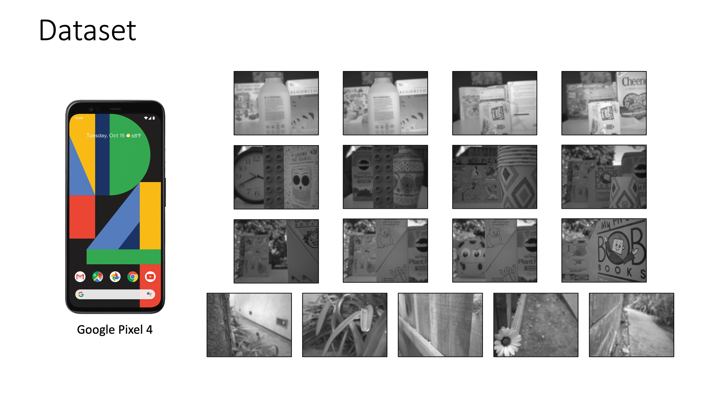

# Defocus Map Estimation and Deblurring from a Single Dual-Pixel Image

This repository is an implementation of the method described in the following paper:

Shumian Xin, Neal Wadhwa, Tianfan Xue, Jonathan T. Barron, Pratul P. Srinivasan, Jianwen Chen, Ioannis Gkioulekas, and Rahul Garg. ["Defocus Map Estimation and Deblurring from a Single Dual-Pixel Image"](http://imaging.cs.cmu.edu/dual_pixel/), ICCV 2021.

If you use our code or dataset, please cite our paper:
```
@article{Xin_2021_ICCV_dual_pixel,
    author    = {Xin, Shumian and Wadhwa, Neal and Xue, Tianfan and Barron, Jonathan T. and Srinivasan, Pratul P. and Chen, Jiawen and Gkioulekas, Ioannis and Garg, Rahul},
    title     = {Defocus Map Estimation and Deblurring From a Single Dual-Pixel Image},
    journal   = {IEEE/CVF International Conference on Computer Vision (ICCV)},
    year      = {2021}
}
```

## Dataset

We captured a new dataset of 17 indoor and outdoor scenes using a Google Pixel 4 smartphone camera. Data can be found in ```./DP_data_pixel_4```.
Google Pixel 4 camera provides dual-pixel (DP) images in the green channel. These DP images are 14-bit, with a black level of 1024. Please refer to [this GitHub Repo](https://github.com/google-research/google-research/tree/master/dual_pixels) for more details about Google Pixel's DP data.

We also provide calibrated blur kernels and vignetting patterns of our device in ```./DP_data_pixel_4/calibration```.



## Code

Code implementation is in ```./code```. It is written in Python, with autograd package [Jax](https://github.com/google/jax). **Note:** When installing Jax, make sure to install with GPU support.

To reproduce results in the paper  (in the paper, results are postprocessed for better visualization), run:

```cd ./code; python ./run.py```

Each optimization runs for 10,000 iterations with an Adam optimizer, and takes about 2 hours on an Nvidia Titan RTX GPU.

Code has been tested with:
* Python 3.7.8
* Jax 0.2.19
* OpenCV 4.4.0

**Note:** To run the code on your own Google Pixel 4 data, please adjust the preprocessing step in ```./code/util.py/load_data_and_calibration``` if needed, such that the input dual pixel images are normalized to the range of [0, 1].